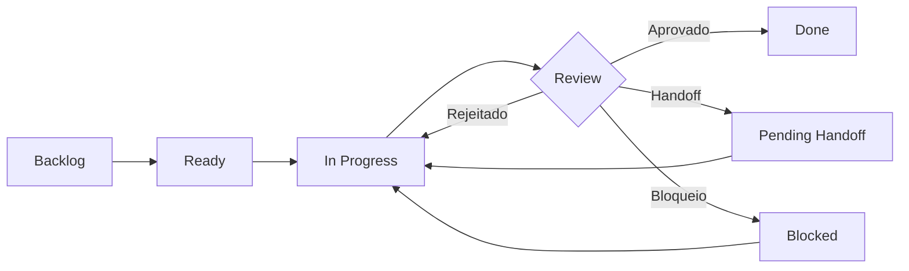

# 📋 GitHub Project Operations - Adaptive Skills

> **Project Kanban:** https://github.com/users/nevitonsantana/projects/3/views/1  
> **Baseado em:** Crisis Monitor Project Operations  
> **Versão:** 1.0.0  
> **Data:** 2026-04-16

---

## 🎯 Objetivo

Este diretório documenta a operação opcional do GitHub Project usado pelos mantenedores do Adaptive Skills para:

- Roadmap e backlog
- Discovery e priorização
- Execução e bloqueios
- Ownership e handoffs

**Regra central:** trabalho real deve deixar rastro em Issues e docs quando aplicável. O GitHub Project é apoio operacional dos mantenedores, não requisito para instalar ou consumir o Adaptive Skills.

---

## 📁 Estrutura de Arquivos

```
.github/
├── README.md                      # Este arquivo
├── GITHUB_PROJECT_OPERATIONS.md   # Regras completas de operação (baseado no Crisis Monitor)
├── SETUP_PROJECT.md               # Guia de setup passo-a-passo (30-45 min)
├── labels-reference.md            # Referência completa de labels
├── labels.yml                     # Definição de labels para gh label sync
├── ISSUE_TEMPLATE/
│   ├── task-kanban.md             # Template para tarefas gerais
│   ├── new-skill.md               # Template para novas skills
│   └── evolution-cycle.md         # Template para evolution observations/proposals
├── KANBAN_GUIDE.md                # Guia de uso do kanban (existente)
├── PROJECT_SETUP.md               # Setup anterior (legado, consultar SETUP_PROJECT.md)
└── SETUP_QUICKSTART.md            # Quickstart (legado, consultar SETUP_PROJECT.md)
```

---

## 🚀 Quick Start

### Para maintainers que usam o Project

1. **Leia as regras operacionais:** [GITHUB_PROJECT_OPERATIONS.md](./GITHUB_PROJECT_OPERATIONS.md)
2. **Configure o Project apenas se for manter este repositório:** [SETUP_PROJECT.md](./SETUP_PROJECT.md)
3. **Crie sua primeira issue:** Use um dos templates abaixo

### Para Iniciar Tarefa Existente

```bash
# 1. Verifique locks e ownership
gh issue view <numero> --comments

# 2. Se livre, faça claim
gh issue comment <numero> --body "Execução iniciada.
<!-- executor-lock: GPT Codex | owner: nevitonsantana | started: $(date -Iseconds) -->"

# 3. Mova para In Progress no Project
gh project item-edit --project-id "PVT_kwDO..." --id "<item-id>" \
  --field "Status" --single-select-option "In Progress"
```

---

## 📊 Issue Templates Disponíveis

### 1. Task Geral ([task-kanban.md](./ISSUE_TEMPLATE/task-kanban.md))

Use para:
- Melhorias de infraestrutura
- Documentação
- Bugs
- Tarefas operacionais

```bash
gh issue create --template task-kanban.md
```

### 2. Nova Skill ([new-skill.md](./ISSUE_TEMPLATE/new-skill.md))

Use para:
- Propor nova skill
- Expandir domínio existente
- Evolution de skill atual

```bash
gh issue create --template new-skill.md
```

### 3. Evolution Cycle ([evolution-cycle.md](./ISSUE_TEMPLATE/evolution-cycle.md))

Use para:
- Registrar observation de piloto
- Propor mudança em skill
- Review de proposal
- Decisão de governança

```bash
gh issue create --template evolution-cycle.md
```

---

## 🏷️ Sistema de Labels

### Prioridade (obrigatório)

| Label | SLA | Uso |
|-------|-----|-----|
| `priority:P0-Critical` | 24-48h | Bloqueia pilotos ou governança |
| `priority:P1-High` | 1 semana | Impacto alto, habilita domínios |
| `priority:P2-Medium` | 2 semanas | Melhoria incremental |
| `priority:P3-Low` | 1 mês | Nice-to-have |

### Categoria (obrigatório)

- `category:skill` - Criação/evolução de skill
- `category:task` - Tarefa geral
- `category:evolution` - Evolution cycle
- `category:infrastructure` - Scripts/tooling
- `category:documentation` - Docs/guides
- `category:pilot` - Piloto de validação
- `category:governance` - Decisões de governança

### Domínio (obrigatório para skills)

- `domain:engineering`, `design`, `product`, `business`, `quality`, `metrics`, `cross-functional`, `efficiency`, `governance`

### Status

- `status:proposal`, `in-progress`, `review`, `blocked`, `ready`, `done`

### Sincronizar Labels

```bash
gh auth login
gh label sync --delete-missing .github/labels.yml
```

Veja todos em [labels-reference.md](./labels-reference.md).

---

## 🔄 Ciclo de Vida da Issue



### Regras Chave

1. **Claim obrigatório:** Publicar `executor-lock` ao iniciar
2. **Handoff documentado:** Comentar troca de ownership
3. **Subissues para paralelismo:** Não dividir issue informalmente
4. **Done só com objetivo completo:** Sem handoff pendente nem subissues abertas

Veja detalhes em [GITHUB_PROJECT_OPERATIONS.md](./GITHUB_PROJECT_OPERATIONS.md).

---

## 📋 Campos Customizados do Project

| Campo | Tipo | Obrigatório | Opções |
|-------|------|-------------|--------|
| Priority | Single Select | ✅ | P0-Critical, P1-High, P2-Medium, P3-Low |
| Executor | Single Select | ✅ | GPT Codex, Claude Code, Human |
| Target Release | Text | ❌ | v1.x.0 |
| Link / Context | Text | ❌ | URL para doc principal |
| Complexity | Single Select | ❌ | XS, S, M, L, XL |
| Domain | Single Select | ❌ | 9 domínios |

---

## 🤖 Comandos Úteis

### Criar Issue com Template

```bash
gh issue create \
  --title "[TASK] Minha tarefa" \
  --template task-kanban.md \
  --label "priority:P2-Medium,category:task,domain:engineering" \
  --project "Adaptive Skills Kanban"
```

### Iniciar Trabalho

```bash
# Claim comment
gh issue comment <num> --body "Execução iniciada.
<!-- executor-lock: GPT Codex | owner: nevitonsantana | started: $(date -Iseconds) -->"

# Mover status
gh project item-edit --project-id "PVT_kwDO..." --id "<id>" \
  --field "Status" --single-select-option "In Progress"
```

### Handoff

```bash
gh issue comment <num> --body "Handoff registrado.
- modelo: same-issue
- de: @nevitonsantana (GPT Codex)
- para: @bruno (Human)"

gh project item-edit --project-id "PVT_kwDO..." --id "<id>" \
  --field "Status" --single-select-option "Pending Handoff"
```

### Encerrar

```bash
gh issue comment <num> --body "Execução encerrada.
<!-- executor-lock: closed | owner: nevitonsantana | finished: $(date -Iseconds) -->"

gh project item-edit --project-id "PVT_kwDO..." --id "<id>" \
  --field "Status" --single-select-option "Done"
```

---

## 🔗 Links Importantes

- **Project Kanban:** https://github.com/users/nevitonsantana/projects/3/views/1
- **Regras Completas:** [GITHUB_PROJECT_OPERATIONS.md](./GITHUB_PROJECT_OPERATIONS.md)
- **Setup opcional para maintainers:** [SETUP_PROJECT.md](./SETUP_PROJECT.md)
- **Labels:** [labels-reference.md](./labels-reference.md)
- **Kanban Atual:** [../PROJECT_KANBAN.md](../PROJECT_KANBAN.md)
- **Roadmap:** [../ROADMAP_EVOLUTIVO.md](../ROADMAP_EVOLUTIVO.md)

---

## 📈 Métricas de Adoção

| Métrica | Meta Q2 2026 | Como Medir |
|---------|--------------|------------|
| Issues com link ao Project | 100% | `gh project item-list` |
| Issues com executor-lock | 90% | Busca por `executor-lock` nos comments |
| Handoffs documentados | 100% | Busca por `Handoff registrado` |
| Comments documentais/tarefa | ≥2 | Média de comments por issue |
| PRs sem Issue vinculada | 0% | PRs sem `Fixes #` ou `Related to #` |

---

## ❓ FAQ

### Posso mover card manualmente?
Sim, mas **deve comentar na Issue no mesmo momento** registrando motivo, responsável e executor.

### Quando usar subissue vs handoff?
- **Subissue:** Paralelismo real (duas pessoas ao mesmo tempo)
- **Handoff:** Sequencial (uma fatia termina antes da outra começar)

### Issue pode ir para Done com subissues abertas?
**Não.** Subissues devem estar todas em Done antes da pai.

### Lock expirou, e agora?
Trate como `stale warning`. Exija handoff ou fechamento explícito antes de reassumir.

---

*Documentação baseada nas regras do Crisis Monitor, adaptada para Adaptive Skills. Última atualização: 2026-04-16*
