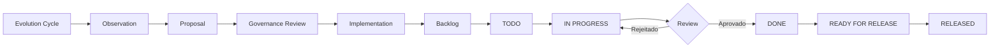

# 📋 Adaptive Skills - Project Kanban

> **Última atualização:** 2026-05-25 (Épico 5 — APM packaging — ready for review)
> **Status do Sprint:** Sprint 2/3 do plano cross-repo — Épicos 1, 2, 3 mergeados; Épico 4 mergeado no AletheIA; Épico 5 em PR
> **Foco atual:** Empacotamento APM (Adaptive Skills) e preparação para Épico 6 (documentação adoptável AletheIA)
>
> **Plano vigente:** [`aletheia-adaptive-skills-plano-cross-repo.md`](../Downloads/_Uteis/AI/AletheIA-Adaptative-Skills/aletheia-adaptive-skills-plano-cross-repo.md) (8 épicos, gates explícitos)

---

## 🎯 Visão Geral do Projeto

| Dimensão | Status | Meta Q2 2026 |
|----------|--------|--------------|
| Skills Validadas | 23/30 | 35 skills |
| Domínios Cobertos | 8/10 | 10 domínios |
| Pilotos Ativos | 5 | 10 pilots |
| Evolution Cycles | 2 completados | 6 cycles |
| Integration Tests | 0% | 60% coverage |

---

## 📊 Quadro Kanban

### 🔴 BACKLOG (Priorização Pendente)

| ID | Tarefa | Domínio | Complexidade | Dependências |
|----|--------|---------|--------------|--------------|
| B01 | Criar skill `product-roadmap-prioritization` | Product | Média | - |
| B02 | Criar skill `governance-compliance-check` | Governance | Alta | AletheIA gates |
| B03 | Definir política de versionamento semântico por skill | Evolution | Baixa | - |
| B04 | Criar índice de descoberta de skills (skill finder) | Infrastructure | Média | - |
| B05 | Documentar guia de telemetry prática | Metrics | Média | - |
| B06 | Identificar cross-skill patterns reutilizáveis | Architecture | Alta | 15+ skills |
| B07 | Criar exemplos de falhas reais (failure cases) | Quality | Baixa | Pilotos ativos |
| B08 | Desenvolver CLI unificada para projeção | Infrastructure | Alta | Scripts atuais |
| B09 | Implementar integration tests para core moves | Testing | Alta | Framework definido |
| B10 | Criar skill bundles por persona (Eng, PM, Designer) | UX | Média | Todas as skills |

---

### 🟡 TODO (Próximas 2 semanas)

| ID | Tarefa | Prioridade | Responsável | Estimativa | Critério de Done |
|----|--------|------------|-------------|------------|------------------|
| T01 | **Preencher skeleton do domínio Product** | 🔴 Alta | Core Team | 3 dias | 3+ skills criadas e validadas |
| T02 | **Preencher skeleton do domínio Governance** | 🔴 Alta | Core Team | 3 dias | 2+ skills criadas + AletheIA integration |
| T03 | Criar guia de telemetry prática com exemplos reais | 🔴 Alta | Metrics Lead | 2 dias | Doc publicado + 3 exemplos de metrics |
| T04 | Criar índice de descoberta (skill finder matrix) | 🟠 Média | Infra Team | 2 dias | Matrix navegável + filtros por domínio/triggers |
| T05 | Revisar triggers de todas as skills da Efficiency Layer | 🟠 Média | QA Lead | 4 dias | 100% das triggers documentadas e testadas |
| T06 | Consolidar observations do cycle #3 | 🟢 Baixa | Evolution Bot | 1 dia | 10+ observations catalogadas |

---

### 🔄 IN PROGRESS (Sprint Atual)

> **Reconciliação 2026-05-21:** WIP reduzido de 7 → 3. P02, P04, P06 e P07 aposentados para a coluna DONE com nota de aposentadoria. Justificativas em `### ✅ DONE` e na seção *Decisões Recentes*.

| ID | Tarefa | Progresso | Bloqueios | Next Step | ETA |
|----|--------|-----------|-----------|-----------|-----|
| P01 | **Piloto: workflow-orchestration em agente real** | 60% (documentado; sem evidência de avanço desde 2026-04-15) | Falta de evidência de execução real | Entregar 1 página de learnings OU aposentar até 2026-05-28 | 2026-05-28 (gate) |
| P03 | **Piloto: feature-planning-breakdown** | 70% (documentado; sem evidência de avanço desde 2026-04-15) | Falta de documento de learnings | Entregar 1 página de learnings OU aposentar até 2026-05-28 | 2026-05-28 (gate) |
| P05 | **Piloto: incident-response-playbook** | 50% (documentado; sem evidência de avanço desde 2026-04-15) | Falta de simulação | Entregar 1 página de learnings OU aposentar até 2026-05-28 | 2026-05-28 (gate) |

---

### ✅ DONE (Últimos 60 dias)

| ID | Tarefa | Concluído em | Impacto | Lições Aprendidas |
|----|--------|--------------|---------|-------------------|
| D01 | Criar Evolution Layer v1.1 com loop de 8 passos | 2026-04-13 | Alto | Governança explícita reduz riscos de regressão |
| D02 | Implementar scripts de validação de skills | 2026-04-10 | Médio | Validação automática economiza 2h/review |
| D03 | Documentar caso real Crisis Monitor | 2026-04-15 | Alto | Evidência prática valida arquitetura Core+Modules |
| D04 | Criar templates de proposal e observation | 2026-04-12 | Médio | Padronização acelera evolution cycles |
| D05 | Mapear 23 skills em 8 domínios | 2026-04-08 | Alto | Coverage inicial suficiente para pilotos |
| D06 | Definir princípios de governança (no auto-edit) | 2026-04-11 | Crítico | Protege invariantes enquanto permite evolução |
| D07 | Integrar projections para Codex/Claude | 2026-04-14 | Médio | Projeção automática funciona em ambos agentes |
| D08 | Adicionar skill `premortem` (Planning domain) | 2026-05-12 ([#24](https://github.com/nevitonsantana/adaptive-skills/pull/24)) | Médio | Primeira skill nova fora do scaffold inicial |
| D09 | Quality Gate CI workflow | 2026-05-12 ([#21](https://github.com/nevitonsantana/adaptive-skills/pull/21)) | Médio | Gate obrigatório em PRs futuros — considerar no Sprint 1 |
| D10 | Rename `adaptative` → `adaptive` em todo o repo | 2026-05-12 ([#23](https://github.com/nevitonsantana/adaptive-skills/pull/23)) | Médio | Normalização ortográfica antes do empacotamento APM |
| D11 | `registry.yaml` → `registry.json` (projections + evolution) | 2026-05-13 ([#30](https://github.com/nevitonsantana/adaptive-skills/pull/30)) | Médio | Formato mais máquina-legível, pré-trabalho para Épico 5 |
| D12 | Reposicionamento Crisis Monitor + README scope | 2026-05-18 ([#31](https://github.com/nevitonsantana/adaptive-skills/pull/31)) | Alto | Handoff explícito ("team-owned field evidence, not active backlog") — pré-trabalho do Épico 2 |
| D13 | `docs/how-to-use-a-skill.md` + adoption flow clarity | 2026-05-19 ([#32](https://github.com/nevitonsantana/adaptive-skills/pull/32)) | Alto | Pré-trabalho do Épico 7 (skill-catalog + fluxos de uso) |
| D14 | Codex/Claude setup alinhado com skill selection | 2026-05-19 ([#33](https://github.com/nevitonsantana/adaptive-skills/pull/33)) | Médio | Pré-trabalho dos Épicos 5/6 (install via APM substitui projection scripts) |
| D15 | `docs/README.md` (docs map) + pilot evidence fields | 2026-05-19 ([#34](https://github.com/nevitonsantana/adaptive-skills/pull/34)) | Médio | Navegação preparada para Épico 7 |
| D16 | Specification facilitation composition | 2026-05-19 | Médio | Composição entre skills documentada |
| **A01** | **P02 piloto testing-strategy-validation — aposentado** | 2026-05-21 | — | Sem evidência de execução em 5 semanas. Tema reabsorvível como exemplo no skill-catalog do Épico 7 se necessário. |
| **A02** | **P04 piloto code-review-patterns — aposentado** | 2026-05-21 | — | Sem evidência de execução em 5 semanas. Mesma justificativa que A01. |
| **A03** | **P06 policy superfícies protegidas — aposentado** | 2026-05-21 | — | Conteúdo dispersou-se em [`docs/skill-model.md`](docs/skill-model.md) (seção *Protected surfaces* existe desde scaffold inicial). Policy formal absorvida no Épico 1 do plano cross-repo (ADR-001/002 do Adaptive Skills). |
| **A04** | **P07 Evolution Cycle #4 (forma original) — aposentado** | 2026-05-21 | — | Cycle reformulado com novo escopo "Reconciliação narrativa" (ver [`ROADMAP_EVOLUTIVO.md`](./ROADMAP_EVOLUTIVO.md), Fase 2). |
| D17 | Épico 1 — ADRs cross-repo + ecosystem-map | 2026-05-22 ([#37](https://github.com/nevitonsantana/adaptive-skills/pull/37)) | Alto | Posicionamento ecossistêmico fixado: ADR-001/002/003 + mapa sincronizado com AletheIA |
| D18 | Épico 2 — Despoluição Crisis Monitor de conteúdo canônico | 2026-05-22 ([#38](https://github.com/nevitonsantana/adaptive-skills/pull/38)) | Alto | Crisis Monitor agora aparece exclusivamente em `domain-packs/` e `docs/crisis-monitor-case-study.md` |
| D19 | Épico 3 — Auditoria agentskills.io + ADR-004 (Caso A) | 2026-05-22 ([#39](https://github.com/nevitonsantana/adaptive-skills/pull/39)) | Crítico | Estratégia de conformância decidida: alta conformância via remediação cosmética; remediação efetiva em Épico 5 |
| **R01** | **Épico 5 — APM packaging + ADR-004 lockstep — ready for review** | 2026-05-25 (branch `feat/apm-package`) | Crítico | Flatten para Skill Collection layout + 24 SKILL.md remediados + apm.yml + ADR-005. PR pendente. |

---

### 🚀 READY FOR RELEASE (Próxima Versão)

| Feature | Skills Incluídas | Version | Release Date |
|---------|------------------|---------|--------------|
| Efficiency Layer v1.1 | workflow, testing, feature-planning, code-review, incident-response | v1.1.0 | 2026-04-25 |
| Domain Pack: Crisis Management | incident-response, stakeholder-comms, root-cause-analysis | v1.0.0 | 2026-04-25 |
| Evolution Toolkit | observation-template, proposal-template, review-checklist | v1.0.0 | 2026-04-25 |

---

## 🏷️ Sistema de Priorização

### Critérios de Prioridade

| Prioridade | Critério | SLA | Exemplo |
|------------|----------|-----|---------|
| 🔴 **Crítica** | Bloqueia pilotos ou viola princípios de governança | 24-48h | Policy de superfícies protegidas |
| 🟠 **Alta** | Impacta >5 skills ou habilita novos domínios | 1 semana | Preencher domains skeleton |
| 🟡 **Média** | Melhoria incremental ou documentação | 2 semanas | Índice de descoberta |
| 🟢 **Baixa** | Nice-to-have ou otimização | 1 mês | CLI unificada |

### Matriz de Decisão

```
                    Impacto Alto    Impacto Baixo
Esforço Baixo      → FAÇA AGORA    → AGENDA FÁCIL
Esforço Alto       → PLANEJE       → ELIMINE/DELEGUE
```

---

## 📈 Métricas do Kanban

| Métrica | Valor Atual | Meta | Status |
|---------|-------------|------|--------|
| Throughput (tarefas/semana) | ~3 (estimado pós-reconciliação) | 7 | 🟡 Atenção |
| Cycle Time médio | indisponível (kanban estava desincronizado) | 3 dias | ⚪ A medir |
| WIP Limit (In Progress) | 3 | 5 | 🟢 OK |
| Taxa de conclusão | n/a até nova baseline | 90% | ⚪ A medir |
| Bugs em produção | 0 | 0 | 🟢 OK |

**Ações corretivas (2026-05-21):**
- ✅ WIP reduzido para 3 ativos (P01, P03, P05) — abaixo do limite, folga para Sprint 1 do plano cross-repo
- Pilotos P01/P03/P05 com gate de decisão em 2026-05-28: entregar 1 página de learnings ou aposentar
- Throughput e cycle time serão remedidos a partir do início do Épico 1 (baseline real)

---

## 🗺️ Próximos Marcos (Milestones)

| Marco | Data Prevista | Entregáveis | Critério de Sucesso |
|-------|---------------|-------------|---------------------|
| **M1: Efficiency Layer v1.1** | 2026-04-25 | 5 skills validadas + pilots | 80% aprovação nos pilots |
| **M2: Domains Completos** | 2026-05-15 | Product + Governance filled | 5+ skills por domínio |
| **M3: Evolution Cycle #6** | 2026-06-01 | 6 cycles completados | 2+ skills evoluídas via processo |
| **M4: Integration Tests** | 2026-06-15 | 60% coverage | Todos core moves testados |
| **M5: v2.0 Release** | 2026-07-01 | 35 skills + CLI | Ready for production use |

---

## 👥 Responsabilidades

| Papel | Responsável | Atribuições |
|-------|-------------|-------------|
| **Product Owner** | Core Team | Priorização, visão estratégica |
| **Evolution Lead** | Automation Bot | Gerenciar cycles, observations |
| **QA Lead** | Core Team | Validação de skills, triggers |
| **Infra Lead** | Core Team | Scripts, projections, CLI |
| **Domain Experts** | Contributors | Criar/revisar skills por domínio |

---

## 🔄 Fluxo de Trabalho



---

## 📝 Notas do Sprint

### Semana de 19-25 Mai 2026 — Onda 0 do plano cross-repo
- **Foco:** Reconciliação de estado (kanban + roadmap) e gate de abertura para Épico 1
- **Risco:** Reabrir trabalho em cima de pilotos parados; retomar narrativa Crisis Monitor centrada
- **Mitigação:** WIP reduzido a 3, Cycle #4 reformulado com escopo amarrado ao plano, gate em 28/05 para pilotos sobreviventes

### Semana de 22-25 Mai 2026 — Sprints 1-2 do plano cross-repo
- **Mergeados:** Épico 1 (PR #37), Épico 2 (PR #38), Épico 3 (PR #39) no Adaptive Skills; Épico 4 (PR AletheIA#151, tag `v0.1.0-alpha`) no AletheIA.
- **Em PR:** Épico 5 — APM packaging do Adaptive Skills + lockstep da remediação ADR-004 (branch `feat/apm-package`, 2 commits).
- **Gates cumpridos:** H5 (Crisis Monitor sai do core sem perda) ✅; decisão A/B/C para conformance (Caso A) ✅.
- **Falsificação parcial registrada:** H2 (APM acelera adoção sem custo de manutenção excessivo) — AletheIA ADR-007 documentou fluxo em dois passos; Adaptive Skills evita o mesmo problema porque skills são primitivos APM nativos.

### Decisões Recentes
0. **2026-05-25:** Épico 5 — decisões A1 (flatten skills/), C1 (version 0.1.0), D3 (domain-packs fora do APM payload) registradas em ADR-005 do Adaptive Skills.
1. **2026-05-21:** Onda 0 fechada — kanban e roadmap reconciliados com estado real (último update real era 2026-04-15, 36 dias stale).
2. **2026-05-21:** Aposentados P02 (testing-strategy-validation), P04 (code-review-patterns), P06 (policy superfícies protegidas), P07 (Evolution Cycle #4 forma original). WIP 7 → 3.
3. **2026-05-21:** Evolution Cycle #4 reformulado com escopo "Reconciliação narrativa: do Crisis Monitor sandbox ao posicionamento ecossistêmico" (período 2026-05-21 a 2026-06-30). Detalhes em [`ROADMAP_EVOLUTIVO.md`](./ROADMAP_EVOLUTIVO.md).
4. **2026-05-21:** P06 absorvido pelo Épico 1 do plano cross-repo (ADR-001/002 do Adaptive Skills) — policy formal será definida lá, não como item isolado.
5. **2026-05-21:** Reconhecido que PRs [#31](https://github.com/nevitonsantana/adaptive-skills/pull/31)-[#34](https://github.com/nevitonsantana/adaptive-skills/pull/34) avançaram pré-trabalho dos Épicos 2, 5, 6, 7 — registrados em DONE (D12-D15) e considerados no planejamento dos respectivos épicos.
6. **2026-04-13:** Aprovado Evolution Layer v1.1 com loop de 8 passos.
7. **2026-04-11:** Definido princípio "no auto-edit" para superfícies protegidas.
8. **2026-04-10:** Priorizar preenchimento de Product e Governance domains *(decisão preservada como histórico; status real em 2026-05-21: ambos os domínios continuam com apenas README.md — será revisto após Épico 1)*.

---

## 🔗 Links Relacionados

- [Roadmap Evolutivo](./ROADMAP_EVOLUTIVO.md)
- [Evolution Backlog](./EVOLUTION_BACKLOG.md)
- [Evolution Layer v1.1](./evolution/EVOLUTION_LAYER_V1.1.md)
- [Skills Registry](./projections/SKILLS_REGISTRY.md)
- [Crisis Monitor Case Study](./domain-packs/crisis-management/CASE_STUDY.md)

---

*Este kanban é atualizado a cada sprint (2 semanas). Última revisão: 2026-05-21 (reconciliação Onda 0)*
