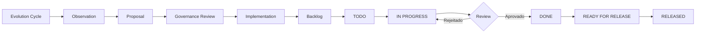

# 📋 Adaptive Skills - Project Kanban

> **Última atualização:** 2026-04-15  
> **Status do Sprint:** Planejamento Q2 2026  
> **Foco atual:** Consolidação da Efficiency Layer v1.1 + Pilotos de Validação

---

## 🎯 Visão Geral do Projeto

| Dimensão | Status | Meta Q2 2026 |
|----------|--------|--------------|
| Skills Validadas | 23/30 | 35 skills |
| Domínios Cobertos | 8/10 | 10 domínios |
| Pilotos Ativos | 5 | 10 pilots |
| Evolution Cycles | 2 completados | 6 cycles |
| Integration Tests | 0% | 60% coverage |

---

## 📊 Quadro Kanban

### 🔴 BACKLOG (Priorização Pendente)

| ID | Tarefa | Domínio | Complexidade | Dependências |
|----|--------|---------|--------------|--------------|
| B01 | Criar skill `product-roadmap-prioritization` | Product | Média | - |
| B02 | Criar skill `governance-compliance-check` | Governance | Alta | AletheIA gates |
| B03 | Definir política de versionamento semântico por skill | Evolution | Baixa | - |
| B04 | Criar índice de descoberta de skills (skill finder) | Infrastructure | Média | - |
| B05 | Documentar guia de telemetry prática | Metrics | Média | - |
| B06 | Identificar cross-skill patterns reutilizáveis | Architecture | Alta | 15+ skills |
| B07 | Criar exemplos de falhas reais (failure cases) | Quality | Baixa | Pilotos ativos |
| B08 | Desenvolver CLI unificada para projeção | Infrastructure | Alta | Scripts atuais |
| B09 | Implementar integration tests para core moves | Testing | Alta | Framework definido |
| B10 | Criar skill bundles por persona (Eng, PM, Designer) | UX | Média | Todas as skills |

---

### 🟡 TODO (Próximas 2 semanas)

| ID | Tarefa | Prioridade | Responsável | Estimativa | Critério de Done |
|----|--------|------------|-------------|------------|------------------|
| T01 | **Preencher skeleton do domínio Product** | 🔴 Alta | Core Team | 3 dias | 3+ skills criadas e validadas |
| T02 | **Preencher skeleton do domínio Governance** | 🔴 Alta | Core Team | 3 dias | 2+ skills criadas + AletheIA integration |
| T03 | Criar guia de telemetry prática com exemplos reais | 🔴 Alta | Metrics Lead | 2 dias | Doc publicado + 3 exemplos de metrics |
| T04 | Criar índice de descoberta (skill finder matrix) | 🟠 Média | Infra Team | 2 dias | Matrix navegável + filtros por domínio/triggers |
| T05 | Revisar triggers de todas as skills da Efficiency Layer | 🟠 Média | QA Lead | 4 dias | 100% das triggers documentadas e testadas |
| T06 | Consolidar observations do cycle #3 | 🟢 Baixa | Evolution Bot | 1 dia | 10+ observations catalogadas |

---

### 🔄 IN PROGRESS (Sprint Atual)

| ID | Tarefa | Progresso | Bloqueios | Next Step | ETA |
|----|--------|-----------|-----------|-----------|-----|
| P01 | **Piloto: workflow-orchestration em agente real** | 60% | Nenhum | Coletar métricas de execução | 2026-04-18 |
| P02 | **Piloto: testing-strategy-validation** | 45% | Nenhum | Validar com 3 PRs reais | 2026-04-20 |
| P03 | **Piloto: feature-planning-breakdown** | 70% | Nenhum | Documentar learnings | 2026-04-17 |
| P04 | **Piloto: code-review-patterns** | 30% | Nenhum | Expandir para 5 reviews | 2026-04-22 |
| P05 | **Piloto: incident-response-playbook** | 50% | Nenhum | Simular incidente controlado | 2026-04-19 |
| P06 | Documentar policy de superfícies protegidas | 80% | Revisão final | Aprovação do core team | 2026-04-16 |
| P07 | Estruturar evolution cycle #4 | 40% | Aguardar P01-P05 | Coletar observations | 2026-04-25 |

---

### ✅ DONE (Últimos 30 dias)

| ID | Tarefa | Concluído em | Impacto | Lições Aprendidas |
|----|--------|--------------|---------|-------------------|
| D01 | Criar Evolution Layer v1.1 com loop de 8 passos | 2026-04-13 | Alto | Governança explícita reduz riscos de regressão |
| D02 | Implementar scripts de validação de skills | 2026-04-10 | Médio | Validação automática economiza 2h/review |
| D03 | Documentar caso real Crisis Monitor | 2026-04-15 | Alto | Evidência prática valida arquitetura Core+Modules |
| D04 | Criar templates de proposal e observation | 2026-04-12 | Médio | Padronização acelera evolution cycles |
| D05 | Mapear 23 skills em 8 domínios | 2026-04-08 | Alto | Coverage inicial suficiente para pilotos |
| D06 | Definir princípios de governança (no auto-edit) | 2026-04-11 | Crítico | Protege invariantes enquanto permite evolução |
| D07 | Integrar projections para Codex/Claude | 2026-04-14 | Médio | Projeção automática funciona em ambos agentes |

---

### 🚀 READY FOR RELEASE (Próxima Versão)

| Feature | Skills Incluídas | Version | Release Date |
|---------|------------------|---------|--------------|
| Efficiency Layer v1.1 | workflow, testing, feature-planning, code-review, incident-response | v1.1.0 | 2026-04-25 |
| Domain Pack: Crisis Management | incident-response, stakeholder-comms, root-cause-analysis | v1.0.0 | 2026-04-25 |
| Evolution Toolkit | observation-template, proposal-template, review-checklist | v1.0.0 | 2026-04-25 |

---

## 🏷️ Sistema de Priorização

### Critérios de Prioridade

| Prioridade | Critério | SLA | Exemplo |
|------------|----------|-----|---------|
| 🔴 **Crítica** | Bloqueia pilotos ou viola princípios de governança | 24-48h | Policy de superfícies protegidas |
| 🟠 **Alta** | Impacta >5 skills ou habilita novos domínios | 1 semana | Preencher domains skeleton |
| 🟡 **Média** | Melhoria incremental ou documentação | 2 semanas | Índice de descoberta |
| 🟢 **Baixa** | Nice-to-have ou otimização | 1 mês | CLI unificada |

### Matriz de Decisão

```
                    Impacto Alto    Impacto Baixo
Esforço Baixo      → FAÇA AGORA    → AGENDA FÁCIL
Esforço Alto       → PLANEJE       → ELIMINE/DELEGUE
```

---

## 📈 Métricas do Kanban

| Métrica | Valor Atual | Meta | Status |
|---------|-------------|------|--------|
| Throughput (tarefas/semana) | 4.5 | 7 | 🟡 Atenção |
| Cycle Time médio | 5.2 dias | 3 dias | 🟡 Atenção |
| WIP Limit (In Progress) | 7 | 5 | 🔴 Excedido |
| Taxa de conclusão | 85% | 90% | 🟢 OK |
| Bugs em produção | 0 | 0 | 🟢 OK |

**Ações corretivas:**
- Reduzir WIP de 7 para 5 tarefas
- Focar em concluir P01-P05 antes de iniciar novas
- Revisar estimativas para reduzir cycle time

---

## 🗺️ Próximos Marcos (Milestones)

| Marco | Data Prevista | Entregáveis | Critério de Sucesso |
|-------|---------------|-------------|---------------------|
| **M1: Efficiency Layer v1.1** | 2026-04-25 | 5 skills validadas + pilots | 80% aprovação nos pilots |
| **M2: Domains Completos** | 2026-05-15 | Product + Governance filled | 5+ skills por domínio |
| **M3: Evolution Cycle #6** | 2026-06-01 | 6 cycles completados | 2+ skills evoluídas via processo |
| **M4: Integration Tests** | 2026-06-15 | 60% coverage | Todos core moves testados |
| **M5: v2.0 Release** | 2026-07-01 | 35 skills + CLI | Ready for production use |

---

## 👥 Responsabilidades

| Papel | Responsável | Atribuições |
|-------|-------------|-------------|
| **Product Owner** | Core Team | Priorização, visão estratégica |
| **Evolution Lead** | Automation Bot | Gerenciar cycles, observations |
| **QA Lead** | Core Team | Validação de skills, triggers |
| **Infra Lead** | Core Team | Scripts, projections, CLI |
| **Domain Experts** | Contributors | Criar/revisar skills por domínio |

---

## 🔄 Fluxo de Trabalho



---

## 📝 Notas do Sprint

### Semana de 15-21 Abr 2026
- **Foco:** Concluir pilotos P01-P05
- **Risco:** WIP excedido pode atrasar entregas
- **Mitigação:** Congelar novas entradas até reduzir In Progress para 5

### Decisões Recentes
1. **2026-04-13:** Aprovado Evolution Layer v1.1 com loop de 8 passos
2. **2026-04-11:** Definido princípio "no auto-edit" para superfícies protegidas
3. **2026-04-10:** Priorizar preenchimento de Product e Governance domains

---

## 🔗 Links Relacionados

- [Roadmap Evolutivo](./ROADMAP_EVOLUTIVO.md)
- [Evolution Backlog](./EVOLUTION_BACKLOG.md)
- [Evolution Layer v1.1](./evolution/EVOLUTION_LAYER_V1.1.md)
- [Skills Registry](./projections/SKILLS_REGISTRY.md)
- [Crisis Monitor Case Study](./domain-packs/crisis-management/CASE_STUDY.md)

---

*Este kanban é atualizado a cada sprint (2 semanas). Última revisão: 2026-04-15*
