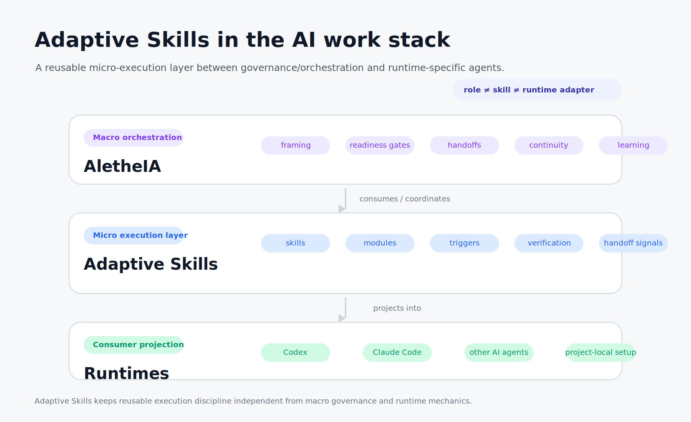
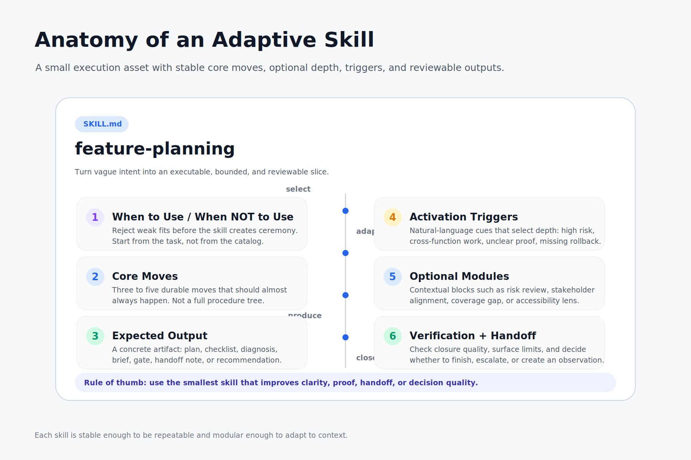
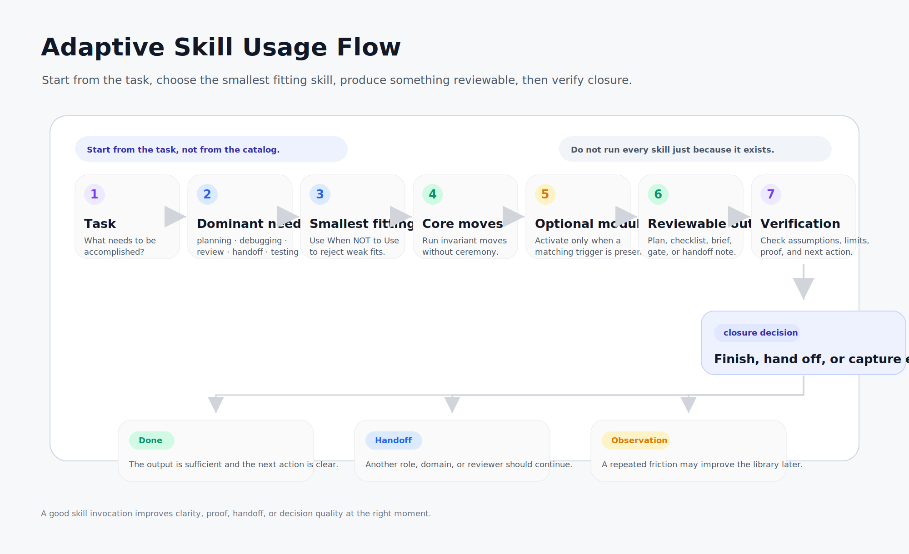

# Adaptive Skills

**Adaptive Skills is a portable library of micro-skills for AI-assisted work.**

It helps agents, teams, and AI-enabled workflows choose the right capability for the task, execute it with discipline, and leave behind outputs that are easier to review, reuse, and improve.

The goal is simple: make AI work less improvised.

Instead of relying on one large prompt, a fixed agent role, or a vague instruction like "be strategic", Adaptive Skills breaks work into small, explicit capabilities such as planning, testing, debugging, UX critique, observability review, premortem analysis, handoff discipline, and domain-specific reasoning.

## Why this exists

AI-assisted work often fails for predictable reasons:

- the agent uses the wrong mode for the problem;
- risks and assumptions stay implicit;
- useful patterns disappear after a thread ends;
- project-specific rules leak into reusable prompts;
- teams cannot tell whether an output was improvised, repeatable, or governed.

Adaptive Skills turns repeated work patterns into small, inspectable assets.

Each skill defines:

- when to use it;
- when not to use it;
- the core moves that should happen;
- optional modules that activate only when needed;
- verification criteria;
- handoff signals and anti-patterns.

This makes skills reusable without turning them into bureaucracy.

## What Adaptive Skills is

Adaptive Skills is the **micro layer** for agentic work.

It does not try to replace product strategy, project management, design systems, or orchestration frameworks. It gives those systems a reusable capability layer: small units of judgment and execution that can be projected into different AI runtimes.

Use it when you want:

- more consistent AI-assisted execution;
- clearer specialist handoffs;
- reusable quality gates;
- better separation between generic practices and project-local rules;
- a governed way to evolve prompts, skills, and operating patterns over time.

<p align="center">
  
</p>

<p align="center"><em>Adaptive Skills provides the reusable micro-execution layer that AletheIA roles and agent runtimes can consume without collapsing governance, skills, and runtime adapters into one system.</em></p>

## How it works

The library is built around **Core + Modules + Triggers**.

- **Core Moves** — the few moves that should almost always happen.
- **Optional Modules** — add-ons that activate only when the context needs them.
- **Activation Triggers** — simple signals that help choose the right modules without building a rigid mini-engine.

This keeps skills practical: structured enough to be repeatable, flexible enough to adapt to the task.

<p align="center">
  
</p>

<p align="center"><em>Each skill is a small execution asset: stable enough to be repeatable, modular enough to adapt to context.</em></p>

## What is in the repository

### Generic skills

Generic skills live under `/skills` and are organized by domain:

- `skills/engineering`
- `skills/design`
- `skills/business`
- `skills/quality`
- `skills/metrics`
- `skills/cross-functional`
- `skills/efficiency`
- `skills/planning`

Current examples include:

- `workflow` — keep work bounded, explicit, and reviewable;
- `feature-planning` — turn vague intent into an executable slice;
- `testing` — define useful validation instead of shallow confidence;
- `debugging` — isolate causes before changing code;
- `ux-writing` — improve product language and semantic clarity;
- `triad-check` — coordinate product, design, and technical reasoning;
- `checkpoint-review` — pause during execution and decide whether to continue, adjust, or hand off;
- `premortem` — assume a future failure happened and work backwards before execution begins.

Skeleton-only domains in v0:

- `skills/product`
- `skills/governance`

### Domain packs

Domain packs live under `/domain-packs`.

They are intentionally specific, versioned, and reusable, but they are **not** treated as generic skill truth.

Current domain pack:

- `domain-packs/crisis-management`

### Projection layer

The repository keeps the canon in source control and treats agent installs as derived artifacts.

- `projections/registry.json` defines projection metadata.
- Codex projection is first-class today.
- Claude projection remains selective and availability-based in v0.

### Evolution layer

Adaptive Skills includes a governed evolution layer so the library can improve without self-rewriting.

It uses:

- observations — real usage signals;
- proposals — reviewable change requests;
- reviews — decisions about whether to change, reinforce, defer, or reject;
- `reinforced` and `no-change` as valid healthy outcomes.

The canon never self-rewrites in v1.1. Human review remains part of the evolution loop.

See:

- `docs/evolution-layer.md`
- `evolution/README.md`

## Repository layout

```txt
/docs           -> model, taxonomy, telemetry, integration notes
/skills         -> generic skills by domain
/domain-packs   -> explicit domain-specific packs
/projections    -> projection registry for agent installs
/evolution      -> governed learning artifacts, observations, proposals, reviews
/scripts        -> validation and projection tooling
/templates      -> starter templates for new skills
```

## Use with or without AletheIA

Adaptive Skills is useful on its own.

Use it without AletheIA when you want:

- reusable execution discipline;
- consistent outputs;
- better specialist handoffs;
- portable skill cards for different AI tools.

Use it with AletheIA when you also want:

- macro framing;
- review gates;
- continuity between rounds;
- structured learning and operational memory.

See:

- `docs/aletheia-integration.md`
- `docs/agent-role-integration.md`

## Current domains

- **Engineering** — implementation, contracts, testing, debugging, structural review
- **Design** — UX strategy, critique, provocation, UX writing
- **Business** — strategic framing and synthesis
- **Quality** — cross-layer quality review
- **Metrics** — observable, decision-linked signals
- **Cross-functional** — triad-style checks for multi-function decisions
- **Efficiency** — chunking, checkpoints, handoff discipline, and bounded execution patterns
- **Planning** — premortem analysis before consequential plans or commitments

## Quick start

Run the repository checks:

```bash
python3 scripts/validate_skills.py
python3 scripts/validate_evolution.py
python3 scripts/report_projection_status.py
python3 scripts/project_to_codex.py --all --dry-run
```

Project all enabled skills into a local Codex skill directory:

```bash
python3 scripts/project_to_codex.py --all
```

Project one skill:

```bash
python3 scripts/project_to_codex.py --skill premortem
```

## Adopt in another project

For the full documentation map, start with:

- `docs/README.md`

Start with:

- `docs/consumer-adoption.md`
- `docs/how-to-use-a-skill.md`
- `docs/codex-consumer-setup.md`
- `docs/claude-consumer-setup.md`
- `docs/first-consumer-pilot.md`
- `examples/README.md`
- `docs/agent-role-integration.md`

Recommended first bundle for a new consumer:

- `workflow`
- `feature-planning`
- `testing`

Add `premortem` when plans have meaningful cost of failure and can still be changed before execution.

<p align="center">
  
</p>

<p align="center"><em>Adaptive Skills starts from the task, not from the catalog. A skill is used only when it improves clarity, proof, handoff, or decision quality.</em></p>

## Current status

### May 2026

| Dimension | Status | Next delivery posture |
|----------|--------|-----------------------|
| Validated skills | 24/35 | Expand only when evidence justifies it |
| Active pilots | 5 | Keep follow-ups evidence-gated |
| Evolution cycle | #3 — Observations | Start Cycle #4 only after reviewable signals |
| Domains | 9/10 | Product + Governance remain skeleton-only |

See:

- `PROJECT_KANBAN.md`
- `ROADMAP_EVOLUTIVO.md`
- `EVOLUTION_BACKLOG.md`

## Field evidence

Adaptive Skills is **domain-agnostic** (see [`docs/adr/ADR-002-domain-agnosticism.md`](docs/adr/ADR-002-domain-agnosticism.md)). The library was first validated against the **Crisis Monitor** project; that case is preserved as labeled field evidence:

- [`docs/crisis-monitor-case-study.md`](docs/crisis-monitor-case-study.md)
- [`domain-packs/crisis-management/`](domain-packs/crisis-management/) — first example domain pack (not the canonical pack)

That case remains evidence for the library, not an active product backlog inside this repository. Additional consumer projects across other domains are expected and prioritized.

## License

Apache-2.0
